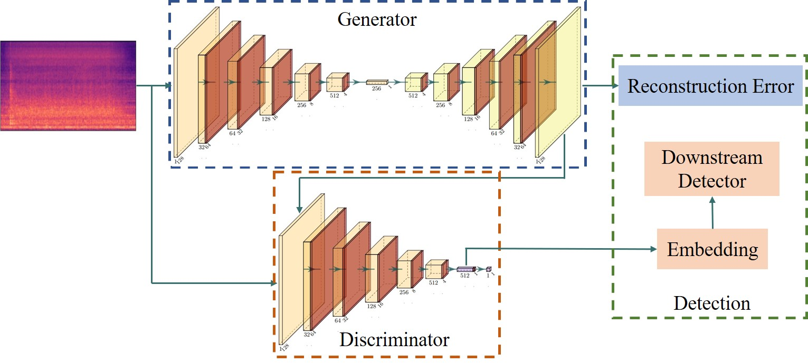

# AEGAN-AD
Official pytorch implementation of AEGAN-AD.



## Introduction

Automatic detection of machine anomaly remains challenging for machine learning. We believe the capability of generative adversarial network (GAN) suits the need of machine audio anomaly detection, yet rarely has this been investigated by previous work. In this paper, we propose AEGAN-AD, a totally unsupervised approach in which the generator (also an autoencoder) is trained to reconstruct input spectrograms. It is pointed out that the denoising nature of reconstruction deprecates its capacity. Thus, the discriminator is redesigned to aid the generator during both training stage and detection stage. The performance of AEGAN-AD on the dataset of DCASE 2022 Challenge TASK 2 demonstrates the state-of-the-art result on five machine types. A novel anomaly localization method is also investigated.


Experiments were conducted on DCASE 20 datset and DCASE 22 dataset. Code for each dataset can be found in the corresponding directory. Please refer to the corresponding instructions below. Two sets of code are mainly the same.

## DCASE 20

### Preparation

Download the dataset from [DCASE official website](https://dcase.community/challenge2020/task-unsupervised-detection-of-anomalous-sounds).

The directory should be organized in the following manner:

```
dataset_dir/
    dev_data/
        fan/
            train/
            test/
            ...
    eval_data/
        fan/
            train/
            test/
            ...
```

Then clone this repository. Modify the `dataset_dir` term in `config.yaml` to your dataset path.

Finally, install required packages:

```
    pip install -r requirements
```

### Training

Hyper parameters are stored in `config.yaml`.

To train a model, please enter:

```
    python train.py --mt {machine type} -c {card_id} --seed {seed}
```

To test a model, please enter:

```
    python test.py --mt {machine type} -c {card_id}
```

### Pretrained Dicts

Pretrained dicts are provided via [Tsinghua cloud](https://cloud.tsinghua.edu.cn/d/3d4ddf315bcf41078e07/).

Place the dict under `./model` (or modify in `config.yaml` to your custom path).

Substitute `config.yaml` by the corresponding config file in `./pretrain/`.

To verify the performance, please enter:

```
    python test.py --mt {machine type} -c {card_id}
```

### Result

|         | fan   | pump  | slider      | ToyCar | ToyConveyor | valve        |
| ------- | ----- | ----- | ----------- | ------ | ----------- | ------------ |
| average | 77.01 | 81.26 | 86.50       | 86.62  | 73.27       | 77.60        |
| metric  | D-LOF | D-LOF | G-x-L2-mean | D-KNN  | G-z-L2-min  | G-z-cos-mean |

- G-z means using the reconstruction error in the latent space of the generator. L2 stands for L2 norm.
- D-LOF means using the LOF algorithm on the embedding of the discriminator.

## DCASE 22

### Preparation

Download the dataset from [DCASE official website](https://dcase.community/challenge2022/task-unsupervised-anomalous-sound-detection-for-machine-condition-monitoring).

The directory should be organized in the following manner:

```
dataset_dir/
    dev_data/
        bearing/
            train/
            test/
            ...
    eval_data/
        bearing/
            train/
            test/
            ...
```

Then clone this repository. Modify the `dataset_dir` term in `config.yaml` to your dataset path.

Finally, install required packages:
```
    pip install -r requirements
```

### Training

Hyper parameters are stored in `config.yaml`.

To train a model, please enter:
```
    python train.py --mt {machine type} -c {card_id} --seed {seed}
```

To test a model, please enter:
```
    python test.py --mt {machine type} -d -c {card_id}
```

### Pretrained Dicts

Pretrained dicts are provided via [Tsinghua cloud](https://cloud.tsinghua.edu.cn/d/3d4ddf315bcf41078e07/).

Place the dict under `./model` (or modify in `config.yaml` to your custom path).

Substitute `config.yaml` by the corresponding config file in `./pretrain/`.

To verify the performance, please enter:
```
    python test.py --mt {machine type} -d -c {card_id}
```

### Result

|        | bearing    | fan         | gearbox     | slider | ToyCar    |
| ------ | ---------- | ----------- | ----------- | ------ | --------- |
| hmean  | 76.03      | 65.83       | 75.27       | 74.06  | 78.46     |
| metric | G-z-L1-sum | G-z-cos-min | G-z-cos-min | D-LOF  | G-z-1-sum |

- G-z means using the reconstruction error in the latent space of the generator. 1 stands for L1 norm.
- D-LOF means using the LOF algorithm on the embedding of the discriminator.
